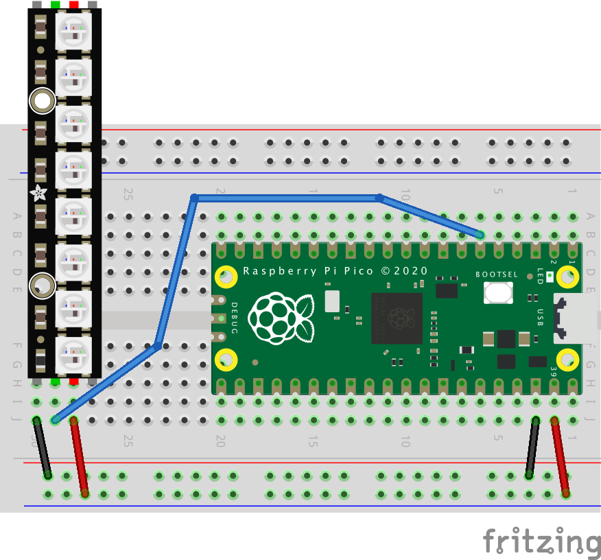

# PixelStrip_MicroPython

PixelStrip is a [MicroPython](https://micropython.org/) module for controlling WS2812 RGB LEDs on the [Raspberry Pi Pico](https://www.raspberrypi.org/products/raspberry-pi-pico/).  These LEDs are also known as  [NeoPixels](https://learn.adafruit.com/adafruit-neopixel-uberguide). The PixelStrip library allows you to add Animations to the strip.  Multiple strips can have separate animations that run in parallel.

Note that the included `npxl.py` module is a rough clone of AdaFruit's [Neopixel library](https://github.com/adafruit/Adafruit_CircuitPython_NeoPixel) for [CircuitPython](https://learn.adafruit.com/welcome-to-circuitpython). 

## Installation

To update MicroPython on your Pico, [download and install the latest UF2 file](https://www.raspberrypi.org/documentation/microcontrollers/micropython.html).

On your laptop, download either [Thonny](https://thonny.org/) or [Visual Studio Code](https://code.visualstudio.com/) with the [Pico-Go](http://pico-go.net/) extension.  Most tutorials use Thonny, which is a good choice.  I choose to work mostly with Visual Studio Code, since that editor is supported by FIRST robotics.

## Trivial Example - Blinking the onboard LED

The Pico board has a tiny LED near the USB plug, which we can cause to blink.  Save the following code into your Pico with the file name `main.py`:

```python
from machine import Pin
import utime

led = Pin(25, Pin.OUT)

while True:
    led.value(1)
    utime.sleep(0.5)
    led.value(0)
    utime.sleep(2.0)
```

This blink program is very useful because it verifies that the basic hardware and software is working.  If you ever reach a point there the board isn't doing anything, you can always load in the blink program to verify that your hardware is wired and powered, that your IDE is working and files are being delivered through USB.

## Simple Example - Blinking a NeoPixel

Wire up your Neopixels (WS2812B LEDs) to power, ground, and digital input. In the following example we will use GP4 for digital input.



Copy the `npxl.py` and `pixelstrip.py` files into your project, and then create the following in a file named `main.py`:

```python
import utime
from pixelstrip import PixelStrip

strip = PixelStrip(4, 8, auto_write=True)

while True:
    strip[0] = (128, 0, 0, 0)
    utime.sleep(0.5)
    strip[0] = (0, 0, 0, 0)
    utime.sleep(0.5)
```

In code, we create a PixelStrip object and assign colors to specific LEDs. Colors are coded as tuples of four integers, each between 0 and 255.

## Animation Example

Animations on a strip can be changed at any time.

New animations should extend `pixelstrip.Animation` and must at least define a new `draw()` function.

```python
import utime
from pixelstrip import PixelStrip, Animation

# Define a new Animation
class BlinkAnimation(Animation):
    def __init__(self):
        Animation.__init__(self)

    def reset(self, strip):
        self.timeout = 1.0

    def draw(self, strip, delta_time):
        if self.is_timed_out():
            self.timeout = 1.0
            lights_on = strip[0][0] != 0
            if lights_on:
                strip.fill((0, 0, 0))
            else:
                strip[0] = (128, 0, 0)
                strip[2] = (0, 128, 0)
                strip[4] = (0, 0, 128)
            strip.show()

# Create a PixelStrip object connected to digital IO pin GP4
strip = PixelStrip(4, 8, auto_write=True)

# Assign an instance of the new Animation into the strip
strip.animation = BlinkAnimation()

# Repeatedly draw the strip, causing the Animation to run
while True:
    strip.draw()
    utime.sleep(0.010)
```


