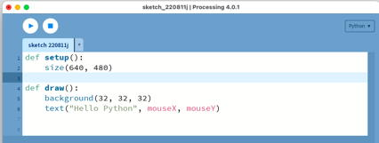

# Sketch graphical programs in Python

[Processing](https://processing.org/) is a graphics library created at MIT to promote programming literacy in the visual arts.  Graphical “sketches” have been written for data analysis, games, or artwork.  Processing provides an easy introduction to programming.  The structure of the sketches themselves is somewhat similar to our robot programs.  Note that there is both a Java and a Python option.

We’ll be using Processing version 4.  Start the Processing application up and it will display a text editor with an empty sketch.  Make sure the menu on the upper right says “Python” rather than "Java".  If the Python mode is not available, you may need to install it with the "Manage Modes" option.



A sketch should have at least the two basic methods:  `setup` and `draw`.  The `setup` method will be called once when the sketch first starts.  Then, the draw method will be called 60 times a second.

Modify the sketch program so setup and draw look like this:
```python
def setup():
    size(640, 480)
    
def draw():
    background(128, 128, 128)
    fill(255, 255, 0)
    stroke(51, 0, 51)
    strokeWeight(3)
    x = 200
    y = 200
    ellipse(x, y, 60, 40)
```

Note that colors are usually given as red-green-blue combinations.  In the above example, the background should be gray and the ellipse drawn in purple but filled with yellow.

Try changing any of the values.  Replace numbers with variables.  Try using other Processing commands listed at: http://processing.org/reference/   Try filling up the window by using variables within for loops or while loops:
```python
def draw():
    background(128, 128, 128)
    for x in range(10, 640, 50):
        for y in range(10, 480, 30):
            fill(x % 256, y // 4, 128)
            ellipse(x, y, 60, 40)
```

The `draw` method is called repeatedly, so you can animate the picture by changing the picture a little each time.  Try the following, and then explain what it’s doing.  Note that we are mixing integers with floating point numbers.
```python
def draw():
    background(128, 128, 128)
    time = millis() / 1000.0
    radius = 100 + 50 * sin(time * 3.14159)
    ellipse(320, 240, radius, radius)
```

Try drawing multiple ellipses.  Try making them pulse at different rates.  The following example also shows movement:
```python
x = 10
y = 20
def draw():
    global x, y
    background(128, 128, 128)
    rect(x, y, 30, 30)
    x = (x + 2) % width
    y = (y + 1) % height
```

Note that the `x` and `y` variables are no longer inside the `draw` method.  They are `global` variables, which allows them to retain their value after the method has finished.  Change the code to make the square bounce off the walls. 

---

## Other Things to Try:
* Draw a picture.  E.g. a face, a car, a spaceship, a robot, a tree.
* Try integrating one of Processing’s dynamic variables: mouseX, key, mouseButton
* Make multiple moving ellipses, or rectangles, or whole pictures.
* Try some of the Example sketches listed under the File menu.

## References:
* Processing: https://processing.org/
* Python Tutorial:  https://docs.python.org/3/tutorial/
* Processing Tutorial:  https://www.youtube.com/watch?v=5N31KNgOO0g

