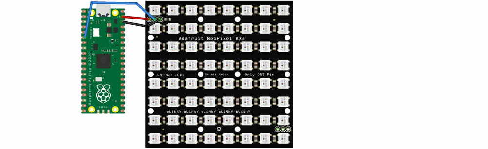

# PixelStrip Matrices

We can do a lot of impressive animations with strips of WS2812B LEDs.  We can also use the same software to control 2-dimensional matrixes of LEDs.  Matrices are more dramatic, although they are also more expensive and they consume more electrical current.



Wiring a matrix is the same as a pixel strip.  You'll need the same three support files loaded onto your Pico:  `npxl.py`, `pixelstrip.py`, and `colors.py`.  When creating a Python object to represent the matrix, you'll specify `height` and `width` parameters. You may also need to an `option` parameter, depending on how the matrix is wired and how it is positioned.  Individual pixels are addrssed by row and column.

Here's a simple matrix program:

```python
import pixelstrip

matrix = pixelstrip.PixelStrip(4, width=8, height=8)
matrix.timeout = 0.0
i = 0

while True:
    if matrix.is_timed_out():
        matrix.clear()
        matrix[i, i] = (0, 0, 128)
        matrix.show()
        i = (i + 1) % 8
        matrix.timeout = 0.7
```

You can break a complex program into smaller functions:

```python
from colors import *
import pixelstrip

matrix = pixelstrip.PixelStrip(4, width=8, height=8)
matrix.timeout = 0.0
r = 0

def draw_vertical_line(m, row, color):
    for col in range(m.height):
        m[row, col] = color

while True:
    if matrix.is_timed_out():
        matrix.clear()
        draw_vertical_line(matrix, r, YELLOW)
        matrix.show()
        matrix.timeout = 0.5
        r = (r + 1) % matrix.width
```

Here's another function for drawing:

```python
from colors import *
import pixelstrip
from random import randint

matrix = pixelstrip.PixelStrip(4, width=8, height=8)
matrix.timeout = 0.0

def draw_box(m, row, col, color):
    m[row, col] = color
    m[row+1, col] = color
    m[row, col+1] = color
    m[row+1, col+1] = color

while True:
    if matrix.is_timed_out():
        matrix.clear()
        r = randint(0, matrix.width)
        c = randint(0, matrix.height)
        draw_box(matrix, r, c, GREEN)
        matrix.show()
        matrix.timeout = 1.0
```