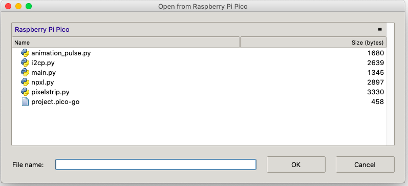
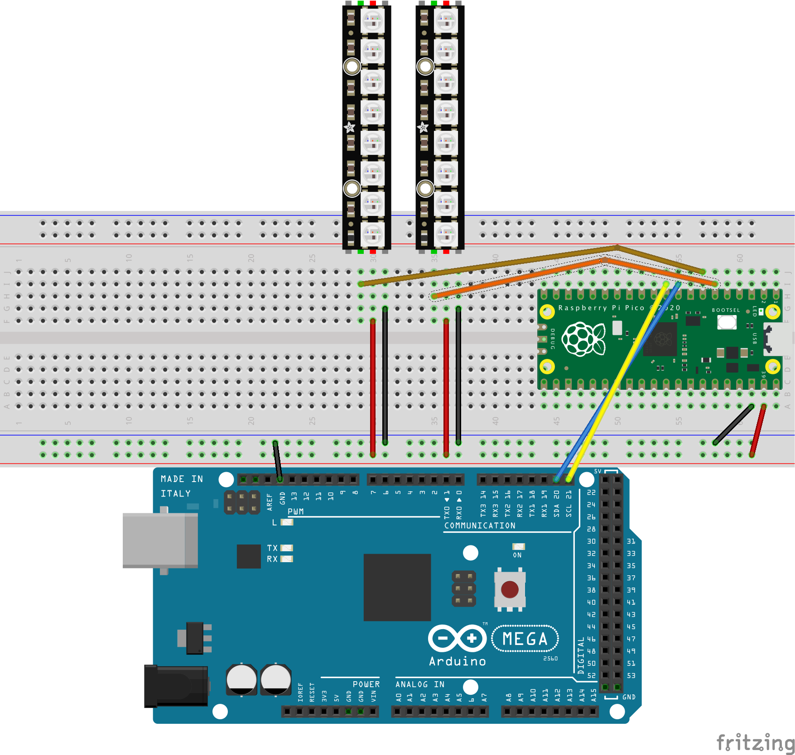

# I2C Animation Test

This project demonstrates that NeoPixel strips connected to a Raspberry Pi Pico can have their animations changed based on I2C communication from an Arduino.  The project has two parts:

* `i2c_animation_tester.ino` is an Arduino program.  It acts as an I2C controller (master device) on the I2C bus.  Every five seconds, it picks a new strip number and animation number. These numbers are coded into a single byte, and the program sends out one byte message on the bus, which should cause animations to change.
* `i2c_animations.py` is a MicroPython program for the Raspberry Pi Pico.  It acts as an I2C peripheral also on the I2C bus.  When it receives a single byte message, it decodes the strip number and animation number from that byte, and then changes the animations on one strip.

When the Arduino sends out its message, it also causes its onboard LED to light for half a  second.  When the Pico receives a message, it causes the Pico's onboard LED to light for half  a second.  If everything is wired correctly, you should see both LEDs blinking at the same time.

## Arduino Software Installation

The Arduino program `i2c_animation_tester.ino` should be loaded with the [Arduino IDE](https://www.arduino.cc/).

For the Pico program, five files should be installed onto the Pico.  First copy the file `i2c_animations.py` and then rename the copy to be `main.py`. Then install:
* `main.py` (formerly `i2c_animations.py`)
* `npxl.py`
* `pixelstrip.py`
* `i2cp.py`
* `animation_pulse.py`

There are many ways to load the Pico program.  You can use [Thonny](https://thonny.org/):

You can also use Visual Studio Code with the [Pico-Go](http://pico-go.net/) extension:

## Arduino Hardware Setup

Connect the Arduino's SDA and SCL pins to corresponding pins on the Pico.  For this example, we are configuring the Pico's GP6 and GP7 pins for I2C.  Also connect ground wires between the two boards.  Ignore the power pin.

When possible, stick to the [Qwiic convention](https://learn.adafruit.com/introducing-adafruit-stemma-qt/technical-specs) of using yellow wire for clock and blue for data.

Wire the two NeoPixel strips to ground, power, and two data pins.  In this example, we are using the Pico's GP4 and GP5 pins for pixel data.

## RoboRIO Software Installation

The `Robot.java` file is a [RoboRIO](https://www.ni.com/en-us/support/model.roborio.html) program.  

This program assumes that you use an XBox controller, but you can easily modify it for any other joystick or game controller. This is a demonstration program that lets you change animations on the Pico.  You can use it as a base for creating a more sophisticated robot program that utilizes PixelStrips.

Starting with Visual Studio Code where you have installed the [WPILib package](https://docs.wpilib.org/en/stable/docs/zero-to-robot/step-2/index.html).  Execute the "Create a new project" task and then select: Template > Java > Timed Skeleton.  From the resulting project, open up the `Robot.java` file and then copy in the value from this repository.

## RoboRIO Hardware Setup

Connect the Pico's ground, clock, and data pins to the I2C pins on the top of the RoboRIO. Don't worry about the power pin.
